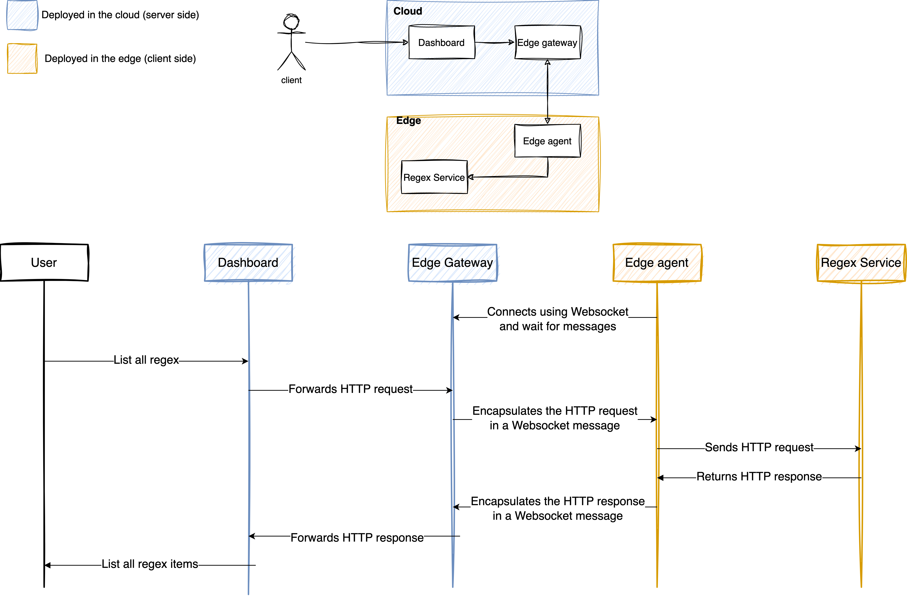

# Edge gateway

## Development

1. Install [goenv](https://github.com/go-nv/goenv/blob/master/INSTALL.md#homebrew-on-mac-os-x)
2. Install Go 1.22 using goenv: `goenv install 1.22`
3. Configure shell to use Go 1.22: `goenv shell 1.22`
4. Install dependencies: `go mod download`

## How it works

- `go run edge_gateway.go` starts a Websocket **gateway** on `http://localhost:8080/ws` and wait for **agents** to connect.
- `go run edge_agent.go -id=AGENT_ID` connects to the **gateway** using the `AGENT_ID` as an unique identifier and wait for messages from the gateway to arrive. Once a message arrives, it looks at its content and performs a HTTP request to the URL of the service specified in the message.
- `./send_request.sh AGENT_ID` will send a HTTP request to the **gateway** on `http://localhost:8080/gateway` in order to access an internal service deployed in a VM of one of our customers on the edge. The **gateway** will then look at the `AGENT_ID` in the request and check if there's any agent with the same ID already connected to it, if so, it will forward the request to the agent dowstream.

### Flow

